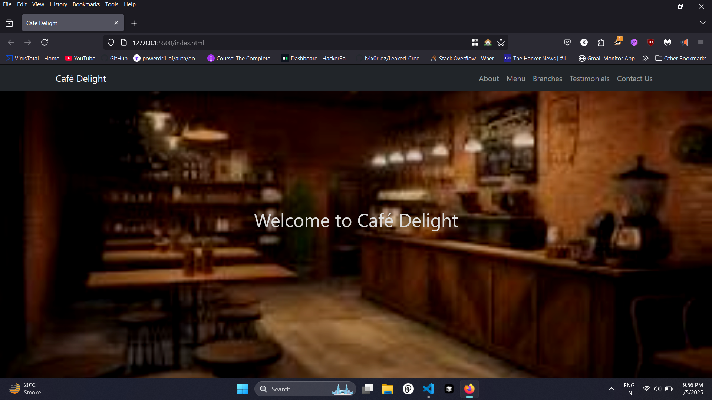

# ☕ Welcome to the Cafe Website! 🍰

## 🌟 Features

- 🍩 **Delicious Menu**: Explore our wide range of pastries, coffees, and more!
- 📱 **Responsive Design**: Looks great on any device!
- 🛒 **Easy Ordering**: Order your favorite items with just a few clicks!

## 🚀 Getting Started

1. **Clone the repo**:
   ```bash
   git clone https://github.com/KunjShah95/cafe-website.git
   ```
2. **Navigate to the project directory**:
   ```bash
   cd cafe-website
   ```
3. **Install dependencies**:
   ```bash
   npm install
   ```
4. **Start the development server**:
   ```bash
   npm start
   ```

## 🛠️ Technologies Used

- **HTML5**: The standard markup language for creating web pages.
- **CSS3**: Styling the web with beautiful designs.
- **JavaScript**: Making the web interactive.
- **React**: A JavaScript library for building user interfaces.

## 📸 Screenshots



## 🤝 Contributing

Contributions are what make the open-source community such an amazing place to learn, inspire, and create. Any contributions you make are **greatly appreciated**.

1. Fork the Project
2. Create your Feature Branch (`git checkout -b feature/AmazingFeature`)
3. Commit your Changes (`git commit -m 'Add some AmazingFeature'`)
4. Push to the Branch (`git push origin feature/AmazingFeature`)
5. Open a Pull Request

## 🏆 Badges


---

Made with ❤️ by [Kunj Shah](https://github.com/KunjShah95)
